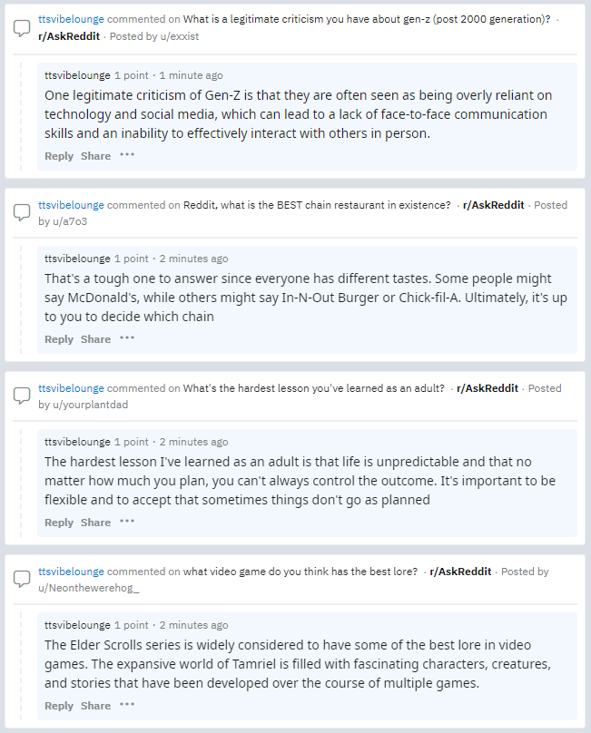

# chatgpt-reddit-bot
Python ChatGPT bot that Replies to Reddit Posts, most of this script was written using ChatGPT 😂

Read the comments posted by this bot here :
<https://www.reddit.com/user/ttsvibelounge/comments/>

## What does this script do?

Gets the title of the latest r/askreddit posts and uses them as prompts to send to ChatGPT :

```
C:\src\chatgpt-reddit-bot\app.py

Title: What's a phrase men hate hearing from women?
ChatGPT Answer:
"We need to talk."

Title: what video game do you think has the best lore?
ChatGPT Answer:
The Elder Scrolls series is widely considered to have some of the best lore in video games. The expansive world of Tamriel is filled with fascinating characters, creatures, and stories that have been developed over the course of multiple games.

Title: What's the hardest lesson you've learned as an adult?
ChatGPT Answer:
The hardest lesson I've learned as an adult is that life is unpredictable and that no matter how much you plan, you can't always control the outcome. It's important to be flexible and to accept that sometimes things don't go as planned

Title: Reddit, what is the BEST chain restaurant in existence?
ChatGPT Answer:
That's a tough one to answer since everyone has different tastes. Some people might say McDonald's, while others might say In-N-Out Burger or Chick-fil-A. Ultimately, it's up to you to decide which chain

Title: What is a legitimate criticism you have about gen-z (post 2000 generation)?
ChatGPT Answer:
One legitimate criticism of Gen-Z is that they are often seen as being overly reliant on technology and social media, which can lead to a lack of face-to-face communication skills and an inability to effectively interact with others in person.

Max comments reached! : 6
```

Then take the ChatGPT repsonses and reply to the r/AskReddit posts :




## Where do I get Reddit API Tokens from?

You can generate Reddit tokens for your user account here :

https://www.reddit.com/prefs/apps

## Where do I get ChatGPT API Tokens from?

You can generate ChatGPT api keys for your account here :

https://beta.openai.com/account/api-keys


## Troubleshooting

I get the error :

```
praw.exceptions.RedditAPIException: RATELIMIT: "Looks like you've been doing that a lot. Take a break for 9 minutes before trying again." on field 'ratelimit'
```

Fix :

Set enable_sleep to True, this will sleep a random amount of minutes before attempting to comment again :

```
enable_sleep = True
```
